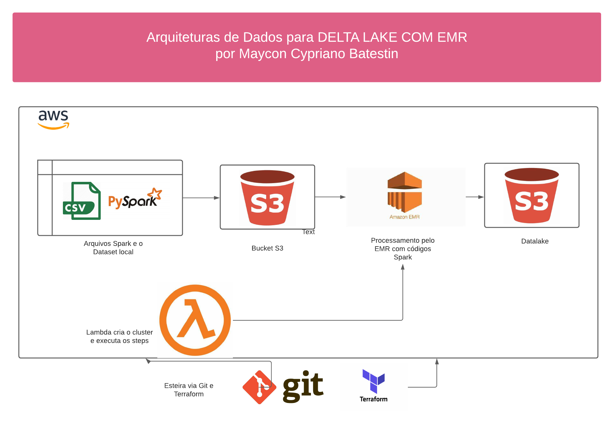
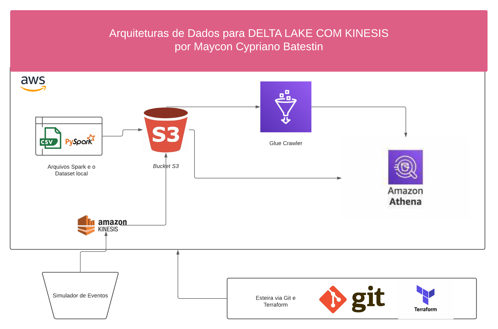

<h1 align="center">

<h3> 
DELTA LAKE COM EMR 
 </h3>
<h3> 
 ================= 
 </h3>

>> <h3> Step I - Arquitetura da solução </h3>

>> <h3> Step II - Streaming Kinesis </h3>

 Para executar a simulação do Kineses
 navegue até <i>scripts/onpremises</i>
 e execute o comando
 <i>python kineses_event.py</i> 

